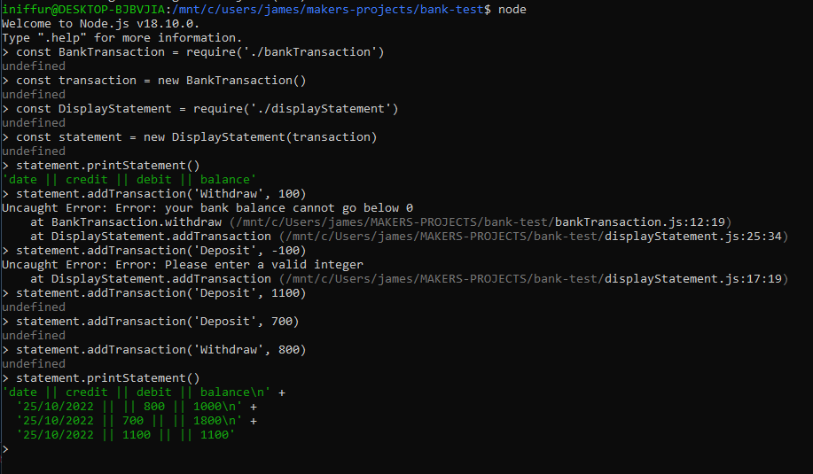
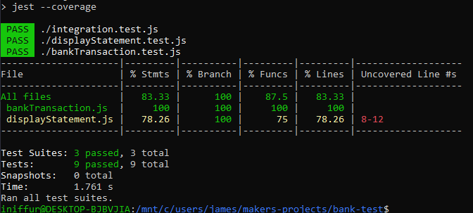

# Bank Tech Test

## Description

This is a small program written in NodeJS to accurately model a minimalistic Bank Account Project, with the ability to deposit, withdraw and view your Bank Statement.

I structured this project with 2 classes - one to handle transactions, and one to handle how the bank statement would be displayed. This decision was made in order to keep the classes short and to the point, whilst also not overcomplicating the project.

## Installation Instructions:

Download this repository and run: 

```
npm install
```

You can use the following commands to run tests and check test coverage:

```
npm test
npm test -- --coverage
```

The rest of the program can be interacted with in the node REPL - and example of which with the output being shown below:



## Current Limitations:

I think the biggest current limitation would be the size of the 'addTransaction()' function in the 'DisplayStatement' method - given more time I would aim to refactor and cut this down.

I have also struggled to perfect jest mocking for the current date - leading to the current test coverage being below 100%

